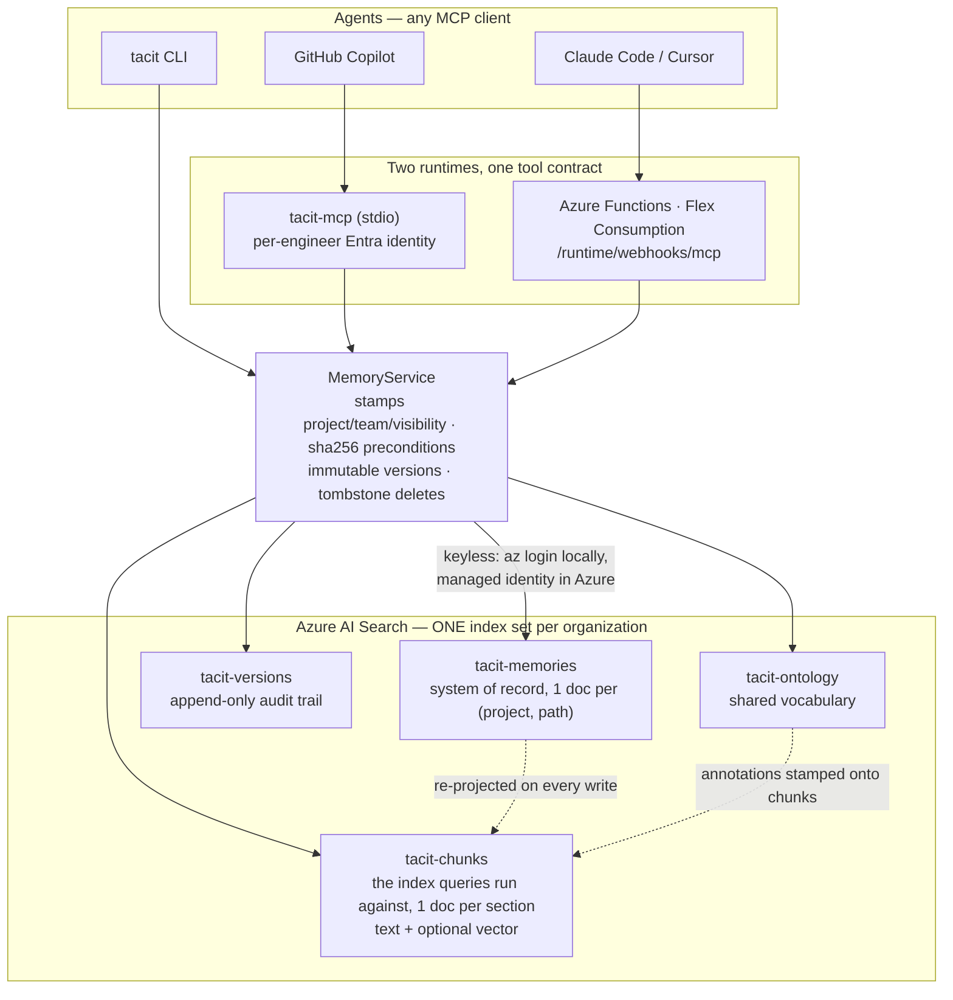
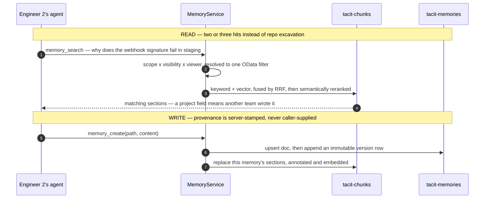

# tacit

**Organizational memory for AI coding agents.** Anthropic's managed-agents
[memory stores](https://docs.claude.com/en/docs/managed-agents/memory) +
[dreams](https://docs.claude.com/en/docs/managed-agents/dreams) model, rebuilt on
Azure so *any* MCP-speaking agent (GitHub Copilot, Claude Code, Cursor) across
*any* team shares one searchable memory.

## Why

When engineer #1's agent learns a project — the `make bootstrap` you can't skip,
the gateway that lowercases webhook headers, the CI job you must never rename —
those learnings die with the session. Engineer #2's agent re-reads the repo,
re-derives the architecture, and relearns every gotcha the hard way.

Worse at organizational scale: *team B* relearns what *team A* already paid for.

tacit makes those learnings a **shared, searchable asset across teams**: agents
write durable facts as they work, and the next agent — in this repo or another
one entirely — answers from two or three memory hits instead of repo excavation.

On the included sample, six onboarding questions cost **10,085 tokens cold vs
~3,500 warm**, with every warm answer verified to contain the right fact. Run
`uv run tacit bench` to reproduce it; see [benchmark/RESULTS.md](benchmark/RESULTS.md).

## How it works



A memory has no file on disk anywhere — `/gotchas/webhook-header-casing.md` is an
address, not a path. The Markdown lives in the `content` field of one
`tacit-memories` document. `tacit-chunks` is a **derived, disposable** projection
of it, one document per `##` section, and is what searches actually run against,
which is why a hit costs the matching section rather than the whole file. Delete
a memory and its chunks go with it, so tombstoned content can never surface.

### Retrieval

A search is one request that ranks three ways at once:

| Layer | What it catches |
| ----- | --------------- |
| **BM25** over title, tags, headings, body, and entity aliases | the exact words |
| **Vector** over the section embedding *(optional)* | the meaning, when nobody used the same words |
| **Semantic ranker** (L2 + extractive captions) | which of the candidates actually answers the question |

Keyword and vector candidates are fused by Azure's RRF, then the semantic ranker
orders what survives — the combination Microsoft documents as the strongest for
relevance. Each layer degrades on its own: a tier without semantic falls back to
BM25, an index without vectors drops that half of the query, and both keep
answering.

Vectors are **off until you configure an embedding deployment**, because a
memory store you can't stand up without a second Azure resource is harder to
adopt than one that gets better when you add it:

```bash
export TACIT_EMBEDDING_ENDPOINT=https://<aoai>.openai.azure.com
uv run tacit provision      # adds content_vector + a query-time vectorizer
uv run tacit reindex        # embed what was already stored
```

Queries use **integrated vectorization**: the question travels to Azure as plain
text and the search service embeds it, so the agent's path is one hop shorter
and only the search service needs access to the model. Writes are different —
memories are *pushed*, not crawled by an indexer, so section vectors are always
computed by whoever is writing. Set `TACIT_USE_VECTORIZER=false` to embed
queries locally instead.

Adding a field is one of the schema changes Azure applies without a rebuild, so
turning vectors on later costs a reindex, not a migration.



## Quick start

One backend, so what you try here is exactly what your team gets.

```bash
uv sync --extra dev
az login
export TACIT_SEARCH_ENDPOINT=https://<svc>.search.windows.net

uv run tacit provision      # the 4 shared indexes, once per service

# Engineer #1's agent stored 7 learnings about the sample project:
uv run tacit seed samples/memories --project contoso-payments

# Engineer #2's agent, day one — one call instead of reading the repo:
uv run tacit search "webhook signature fails staging" --project contoso-payments

# A DIFFERENT team's repo reaches the same knowledge:
uv run tacit search "webhook signature fails staging" --project search-svc
```

`tacit provision` runs **once per Search service, not once per team** — every
project writes into the same index set, which is what lets one team's memory
answer another team's question. Onboarding a team is just pointing it at the
endpoint with its own `TACIT_PROJECT`, and costs no additional indexes.

## Scope and visibility

Every memory is addressed by `(project, path)` and published under a
**visibility**; every search runs at a **scope**. Together they decide what
reaches whom.

| Visibility        | Who can find it                             |
| ----------------- | ------------------------------------------- |
| `org` *(default)* | Anyone in the organization                  |
| `team`            | Projects belonging to the same `TACIT_TEAM` |
| `private`         | Only the project that wrote it              |

| Scope                     | What it searches                                  |
| ------------------------- | ------------------------------------------------- |
| `project+org` *(default)* | This repo **plus** what other teams published     |
| `project`                 | This repo only                                    |
| `org`                     | Other teams only — "has anyone else solved this?" |

A hit from another team carries a `project` field; a hit from your own does not.
That presence *is* the signal that a result crossed a boundary, so an agent can
weigh it as a lead rather than as fact about your repo.

> **What visibility protects, and what it does not.** `private` and `team` are
> enforced against the *viewer* — the project and team the server was configured
> with — never against the project named in a tool call, so naming another team's
> project routes your request without granting its privileges. But anything
> published `org`-wide is reachable by anyone who can call the endpoint, by
> design. Real access control is Entra RBAC on the Search service plus the
> Functions key — **never store secrets in a memory of any visibility.**

## One thing, many names

Payments writes "pmt-gw", platform writes "the gateway", the new hire asks about
"the payments gateway" — one system, three names, and no ranker bridges them,
because the connection is a fact about *your organization*, not about English.

So tacit keeps a small controlled vocabulary, applied **at write time**: every
chunk is annotated with the canonical entities it mentions plus all their
aliases as searchable text. Query latency is untouched, the ranker still sees
the user's real question, and matching is deterministic — no model, no drift.

```bash
uv run tacit ontology add "Payments Gateway" \
    --aliases "pmt-gw,the gateway,Stripe proxy" --kind system
uv run tacit reindex        # annotations live on chunks, so re-project them
```

Agents can also filter to one entity — `memory_search(entity="payments-gateway")`
is "everything the org knows about this thing, whatever each team calls it".

## Seeing the overlap

```bash
uv run tacit ui             # or /api/ui on the deployed Function App
```

Entities sit in the middle, the projects that wrote about them around the
outside, and an entity known to **more than one team turns orange** — that is
knowledge somebody is about to rediscover the hard way. Click a node to see the
memories behind it. The graph is built from the same visibility rules search
uses, so it is per-viewer: a private memory contributes no node, no edge, and no
count.

The page also carries a **search box over the same `memory_search` tool an agent
calls** — same scope, project, category and entity filters, same ranked sections,
same "from *other-team*" badge when a hit crosses a boundary. It is the fastest
way to see what your agents will actually get back.

## Wire up your team

```bash
uv run tacit install --project contoso-payments \
    --search-endpoint https://<svc>.search.windows.net \
    --function-app <app-name>        # optional: the no-clone remote variant
```

That prints ready-to-paste config for Claude Code, VS Code / GitHub Copilot
(`.vscode/mcp.json`), Copilot CLI, and the deployed Functions endpoint — plus an
**AGENTS.md snippet** telling agents to search memory before exploring. Commit
both: wiring without instructions gets ignored.

In a repo that has never used team memory, an agent can call the **`tacit_setup`
tool**, which returns those standing instructions for it to write itself. It is a
tool rather than only a prompt because tools reach every client and transport —
see [DESIGN.md](DESIGN.md) for why that matters.

### MCP tools

`memory_search` (ranked hits across teams) · `memory_brief` (one-call onboarding
pack) · `memory_read` · `memory_list` · `memory_create` · `memory_update`
(sha-preconditioned) · `memory_delete` (tombstone) · `memory_versions` ·
`tacit_setup`.

`memory_search` takes `scope` and `entity`; `memory_create`/`memory_update` take
`visibility`. Every tool takes an optional `project`, since one endpoint serves
every repo.

### Configuration

| Env var                    | Meaning                                               |
| -------------------------- | ----------------------------------------------------- |
| `TACIT_SEARCH_ENDPOINT`    | Azure AI Search service (required)                    |
| `TACIT_PROJECT`            | Repo slug this process reads/writes (stdio infers it) |
| `TACIT_TEAM`               | Owning team — resolves `visibility: team`             |
| `TACIT_DEFAULT_VISIBILITY` | Visibility for new memories (default `org`)           |
| `TACIT_AUTH_MODE`          | `default-credential` (default) or `azure-cli`         |
| `TACIT_EMBEDDING_ENDPOINT` | Azure OpenAI endpoint — set it to enable hybrid search |
| `TACIT_EMBEDDING_DEPLOYMENT` | Embedding deployment (default `text-embedding-3-small`) |
| `TACIT_EMBEDDING_MODEL`    | Model behind that deployment, for the vectorizer       |
| `TACIT_EMBEDDING_DIMENSIONS` | Vector size (default `1536`)                        |
| `TACIT_USE_VECTORIZER`     | Let Search embed queries (default `true`)             |

## Deploy

```bash
azd up      # AI Search + Flex Consumption Functions + RBAC, keyless
```

`azd up` also deploys an Azure OpenAI embedding deployment and grants both the
Functions identity and you access to it, so hybrid search is on by default. Pass
`embeddingModel=""` to skip that resource and run keyword + semantic only.

To reuse an embedding model you already have, pass its endpoint instead — the
template then creates no Azure OpenAI account, and you grant **Cognitive Services
OpenAI User** on your resource to the two principals it outputs
(`FUNCTION_APP_PRINCIPAL_ID` writes vectors, `SEARCH_PRINCIPAL_ID` embeds
queries):

```bash
azd env set EMBEDDING_ENDPOINT https://<existing>.openai.azure.com
```

Teammates who don't want a clone point their MCP client straight at
`https://<app>.azurewebsites.net/runtime/webhooks/mcp` with the `mcp_extension`
system key as `x-functions-key`.

> The bicep defaults to AI Search's **Serverless tier** (preview): billed per
> Compute Unit and GB stored, no capacity to provision — a good fit for bursty
> team-memory traffic, but limited to westcentralus / switzerlandnorth /
> japaneast with no SLA. Pass `searchSku=basic` for production or other regions.
>
> Prompts are **not** registered on the Functions runtime: the extension's
> prompt trigger needs `azure-functions` 2.x (Python ≥3.13) while the remote
> build resolves 3.12, so invoking one errors. Every workflow is reachable as a
> tool instead. The stdio server does register them.

## How it relates to pemp and foundry-iq

- **pemp** is *personal* memory (local-first, markdown+git). tacit lifts its
  invariants — immutable versions, optimistic concurrency, tombstones,
  structured conflicts — to an *organizational* store.
- **foundry-iq-cli** answers "what do the *documents* say". tacit answers "what
  has the *team already learned*". They compose: an agent checks team memory
  first, falls back to the doc KB, then to the repo.
- **Anthropic memory stores** already give Claude managed agents mounted,
  versioned memory. tacit earns its keep when the team is *mixed* or when memory
  must live in your Azure tenant. `dream.Consolidator` is a protocol, so a real
  Dream can be swapped in for the heuristic consolidator.

## Development

```bash
uv sync --extra dev
uv run --extra dev pytest                                     # 83 tests, no Azure calls
az bicep build --file infra/main.bicep --stdout > /dev/null   # infra lint
```

Design rationale, invariants, and the retrieval model: [DESIGN.md](DESIGN.md).
Security red lines: no secrets in payloads, config, or MCP wiring; mutations
always require the caller's `expected_sha256`; dreams never modify their input
store; visibility is a relevance boundary, never a substitute for RBAC.
